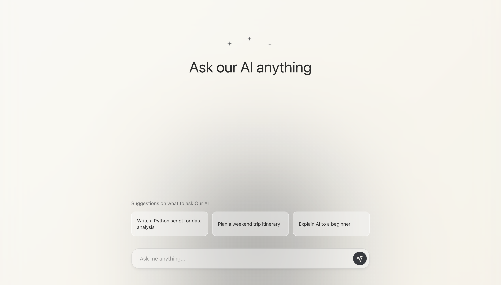

# YourAI Chat

Минималистичный AI-чат с glassmorphism эффектами и интерактивным фоном.

## Скриншоты




## Технологии

- React 18 + TypeScript
- Redux Toolkit
- CSS Modules
- OpenRouter API (Mistral 7B)

## Установка

```bash
npm install
```

## Настройка

Создай `.env.local` в корне проекта:

```env
VITE_OPENROUTER_API_KEY=your_api_key_here
```

Получить API ключ: [openrouter.ai/keys](https://openrouter.ai/keys)

## Запуск

```bash
npm run dev
```

## Фичи

- 🎨 Glassmorphism UI
- 🎯 Интерактивный курсор-фолловер
- ⚡ Быстрые промпты
- 💬 Real-time чат с AI
- 📱 Адаптивный дизайн
- 🎭 Плавные анимации и переходы

## В разработке

- 💾 Сохранение истории чатов
- 🌓 Переключение темы (светлая/темная)
- 🤖 Выбор AI агентов и моделей
- 📁 Экспорт/импорт диалогов
- ⚙️ Настройка параметров модели
- 🔍 Поиск по истории чатов
- 🏷️ Теги и категории для диалогов

## Git Flow

```bash
# Разработка
git checkout develop

# Новая фича
git checkout -b feature/your-feature
git commit -m "feat: your feature"
git checkout develop
git merge feature/your-feature

# Релиз
git checkout main
git merge develop
```
